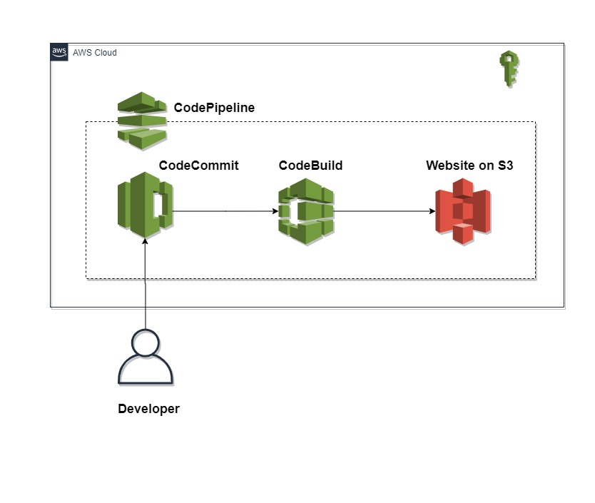

## Contributors
- Muhammad Umar (Host)
# Project-5 - CICD React Deployment on Amazon S3 using CodeCommit, CodeBuild, Codepipeline and Terraform Multi Env
#  Author: Muhammad Umar                                        
#  Email : m.umerpervaiz@gmail.com     

                     

This project demonstrates how to deploy a React application on Amazon S3 using CodeCommit, CodeBuild, and CodePipeline. By following the steps outlined in this repository, you'll be able to set up a continuous deployment pipeline for your React app, ensuring automatic updates and smooth delivery to your S3 bucket.

## Table of Contents

- [Prerequisites](#prerequisites)
- [Installation](#installation)
- [Usage](#usage)
- [Contributing](#contributing)
- [License](#license)
- [Contact](#contact)

## Prerequisites

Before getting started, ensure you have the following prerequisites:

- AWS account with permissions to create CodeCommit repositories, CodeBuild projects, and CodePipeline pipelines.
- Node.js and npm installed on your local machine for React app development.

## Installation

Follow these steps to set up the deployment pipeline for your React app:

1. Fork this repository and clone it to your local machine.
2. Create a new CodeCommit repository to store your React app code.
3. Replace the sample React app in the repository with your own application code.
4. Configure the build settings in `buildspec.yml` for CodeBuild to compile your React app.
5. Create a new S3 bucket to host your React app.
6. Create a CodePipeline in AWS, specifying CodeCommit as the source, CodeBuild for the build stage, and S3 for the deployment stage.

### Makefile Commands

To simplify the deployment process, you can use the following Makefile commands located in the root directory of this project:

- `make init-dev`: Initialize Terraform Configurations of dev Environment
- `make fmt-dev`: Formate Terraform Configurations of dev Environment
- `make validate-dev`: Validate Terraform Configurations of dev Environment
- `make plan-dev`: Plan Terraform Configurations of dev Environment
- `make apply-dev`: Apply Terraform Configurations of dev Environment
- `make destroy-dev`: Destroy Terraform Configurations of dev Environment

These commands will handle the initialization, validation, planning, applying, and destroying of your Terraform infrastructure for the dev environment.

## Usage

Once the deployment pipeline is set up, any changes pushed to the CodeCommit repository will trigger the pipeline to automatically build and deploy the updated React app to the specified S3 bucket.

## Contributing

Contributions are welcome! If you find any issues or have improvements to suggest, feel free to open a pull request.

## License

This project is licensed under the [MIT License](LICENSE).

## Contact

For any inquiries or questions, please contact me at [umar@techwithomar.com](mailto:umar@techwithomar.com) or visit my website [https://techwithomar.com/](https://techwithomar.com/).
